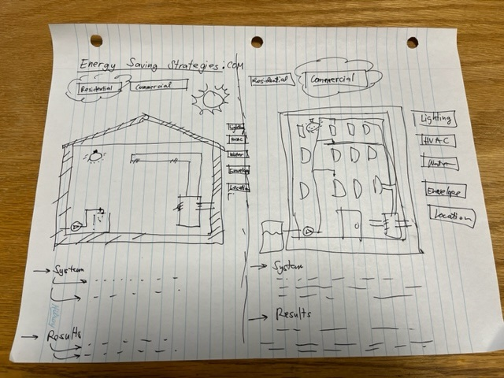

# Energy Saving Strategies Dot Com
Energy Saving Strategies Dot Com: Your Pathway to Sustainable Living and Thriving Businesses!
# Descritpion
In a world pulsating with energy demands, finding innovative and effective ways to optimize energy consumption has never been more crucial. At EnergySmart Solutions, we are dedicated to illuminating the pathway to a sustainable future for both residential spaces and commercial establishments. Our mission is clear: empower individuals and businesses with the knowledge and tools they need to minimize their environmental footprint while maximizing efficiency and cost savings.

In the realm of energy efficiency, knowledge is power, and that’s where we come in. Our platform serves as a beacon of information, guiding you through the intricate maze of energy-saving strategies. Whether you're a homeowner aiming to create an eco-friendly oasis or a business owner seeking to enhance operational efficiency, we have tailored solutions that fit your unique needs.

Our team of experts curates a wealth of cutting-edge insights and practical tips designed to demystify the complexities of energy consumption. From the latest advancements in renewable energy technologies to simple yet impactful lifestyle changes, we explore every facet of energy conservation. By implementing our strategies, you not only contribute to a greener planet but also unlock substantial savings on your utility bills.
# Motivation
At EnergySmart Solutions, we believe that sustainable living and thriving businesses go hand in hand. By embracing energy-efficient practices, you not only protect the environment but also bolster your bottom line. Join us on this transformative journey towards a future where energy is harnessed wisely, resources are conserved thoughtfully, and both homes and businesses thrive harmoniously with our planet. Let's embark on this exciting adventure together, reshaping the way we consume energy and creating a brighter, greener tomorrow for all.
Training to code, project repository
# Screenshot

